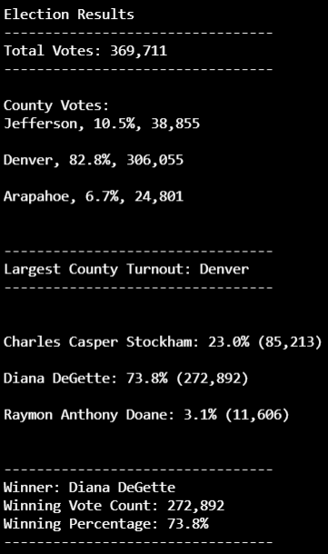

# Election_Analysis
Analyzing Election data through the use of Python

## Project Overview
Tom and Seth are a part of a Colorado Board of Elections and tasked with the following objectives in order to analyze the election audit of a recent local election.

1. Calculate the total number of votes cast.
2. Get a complete list of candidates who received votes.
3. Calculate the total number of votes each candidate received.
4. Calculate the percentage of votes each candidate won.
5. Determine the winner of the election based on popular vote.

### Overview of Election Audit
To further analyze the election audit in terms of percentage of votes being counted in each county, overall vote count in each county, and interpreting which county had the greater number of voter turnout.

## Election-Audit Results

Upon analysis of the election data, it reveals:
- There was a total of **369711** overall votes
- **Denver County** had the largest overall turnout of any county
    -Denver County account for 306,055 votes, approximately 82.8% of the overall vote of 369711
- The candidates that ran for election were:
    - Charles Casper Stockham: 85,213 (23 %)
    - Diana DeGette: 272,892 (73.8%)
    - Raymon Anthony Doane: 11,606 (3.1%)
- The individual results of the candidates were:
    - Charles Casper Stockham received 85,213 votes, roughly 23% of the overall votes
    - Diana DeGette received 272,892 votes, roughly 73.8% of the overall votes
    - Raymon Anthony Doane received 11,606 votes, roughly only 3.1% of the overall votes
- The winner of the election was **Diana DeGette**

## Election Audit Summary

After running the new updated script to analyze this specific set of election data, we see how effective it was in analyzing such a large amount of data in a CSV file. The Colorado Board of Elections can use this in future elections to more efficiently interpret election data. By having this script, they can better determine, which county is receiving a larger voter turnout and can perhaps come up with solutions on how to better improve voter turnout in key counties in future elections. The Board or anyone interested in election data simply needs to replace the csv file in the beginning of the code with the file they wish to analyze. The script is a powerful tool in the sense it can provide a more interpretive explanation as to which candidates fare better in which counties and can cross reference that with the campaigns of these candidates to observe whether or not their campaign promises caters toward a specific county over another. This script can be used to observe any election by changing the file and also determining which county had a lower voter turnout relative to its population. Overall, it can be useful to anyone who wishes to interpret a large dataset and have an efficient way of doing so.

## Resources
- Data Source: election_results.csv
- Software: Python 3.7.8, Visual Studio Code 2019, GitBash

    

